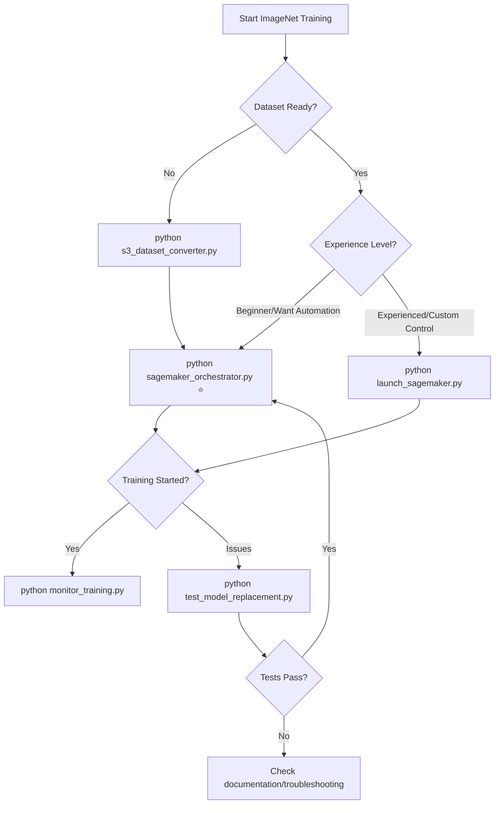

# 🎯 Main Entry Points Guide

**Choose the right starting point for your ImageNet SageMaker training with automatic model replacement.**

## 🚀 Quick Decision Matrix

| Your Goal | Entry Point | Command | Time |
|-----------|-------------|---------|------|
| **Complete automated training** | `sagemaker_orchestrator.py` | `python sagemaker_orchestrator.py` | 5 min setup |
| **Direct SageMaker job launch** | `launch_sagemaker.py` | `python launch_sagemaker.py --job-name "my-job"` | 2 min setup |
| **Dataset conversion only** | `s3_dataset_converter.py` | `python s3_dataset_converter.py --bucket "my-bucket"` | 10-30 min |
| **Monitor existing training** | `monitor_training.py` | `python monitor_training.py --job-name "existing-job"` | Immediate |
| **Test model replacement** | `test_model_replacement.py` | `python test_model_replacement.py` | 1-2 min |

---

## 🏆 Entry Point 1: `sagemaker_orchestrator.py` ⭐ **RECOMMENDED**

### **🎯 When to Use**
- ✅ You want **complete end-to-end automation**
- ✅ You need **automatic model replacement every epoch**
- ✅ You want **professional monitoring and logging**
- ✅ You prefer **one-command complete pipeline**
- ✅ You need **production-ready training**

### **⚡ Quick Start**
```bash
# Complete automated pipeline (everything included)
python sagemaker_orchestrator.py
```

### **🔧 Advanced Usage**
```bash
# With custom configuration
python sagemaker_orchestrator.py --config configs/pipeline_config.json

# With specific parameters
python sagemaker_orchestrator.py \
    --instance-type "ml.p3.16xlarge" \
    --epochs 90 \
    --use-spot-instances
```

### **✨ What It Does Automatically**
1. **🔍 Validates AWS environment** (credentials, permissions, resources)
2. **🌐 Converts dataset** (ILSVRC → SageMaker format, if needed)
3. **☁️ Launches SageMaker training** (with optimal configuration)
4. **🔄 Enables model replacement** (automatic every epoch)
5. **📊 Monitors training progress** (real-time updates)
6. **💰 Handles spot instances** (cost optimization + fault tolerance)
7. **📦 Creates deployment archives** (SageMaker-ready models)
8. **📋 Generates training summary** (complete metrics and analysis)
9. **🧹 Performs cleanup** (organizes outputs and temporary files)

### **📊 Expected Output**
```
✅ Complete Training Pipeline Results:
├── models/
│   ├── model_current.pth      # Latest epoch (replaced automatically)
│   ├── model_best.pth         # Best accuracy model
│   └── model_final.pth        # Final training state
├── model.tar.gz              # SageMaker deployment archive
├── training_summary.json     # Complete metrics and analysis
├── logs/                     # Detailed training logs
└── checkpoints/             # Automatic fault-tolerance checkpoints
```

---

## ☁️ Entry Point 2: `launch_sagemaker.py`

### **🎯 When to Use**
- ✅ You have **existing converted dataset**
- ✅ You want **direct SageMaker control**
- ✅ You need **custom training parameters**
- ✅ You're **experienced with SageMaker**
- ✅ You want **model replacement without full orchestration**

### **⚡ Quick Start**
```bash
# Standard training with model replacement
python launch_sagemaker.py \
    --job-name "imagenet-training-$(date +%Y%m%d)" \
    --role-arn "arn:aws:iam::123456789:role/SageMakerRole" \
    --train-data-s3 "s3://my-bucket/imagenet-sagemaker/" \
    --enable-model-replacement
```

### **🔧 Advanced Usage**
```bash
# Production training
python launch_sagemaker.py \
    --job-name "production-resnet50" \
    --role-arn "arn:aws:iam::123456789:role/SageMakerRole" \
    --train-data-s3 "s3://my-bucket/imagenet-sagemaker/" \
    --instance-type "ml.p3.8xlarge" \
    --spot-training \
    --epochs 90 \
    --batch-size 256 \
    --pipeline-stage "full_training" \
    --enable-model-replacement

# Quick testing/development
python launch_sagemaker.py \
    --job-name "quick-test" \
    --instance-type "ml.p3.2xlarge" \
    --epochs 5 \
    --pipeline-stage "lr_range_test" \
    --enable-model-replacement
```

### **⚙️ Pipeline Stage Options**
```bash
--pipeline-stage "lr_range_test"      # Learning rate range testing
--pipeline-stage "lr_bounds"          # LR boundary determination
--pipeline-stage "onecycle_lr"        # OneCycle LR testing
--pipeline-stage "batch_size_test"    # Batch size optimization
--pipeline-stage "weight_decay_tuning" # Weight decay optimization  
--pipeline-stage "full_training"      # Complete model training
--pipeline-stage "monitoring"         # Results analysis
```

### **📊 Expected Output**
- ☁️ Active SageMaker training job
- 🔄 Automatic model replacement every epoch
- 📊 Real-time training metrics
- 💰 Cost tracking (especially with spot instances)

---

## 🌐 Entry Point 3: `s3_dataset_converter.py`

### **🎯 When to Use**
- ✅ You have **ILSVRC dataset in S3** that needs conversion
- ✅ You want to **convert dataset separately** before training
- ✅ You need **validation and test data reorganized** by class
- ✅ You want to **verify dataset structure** before training

### **⚡ Quick Start**
```bash
# Convert your existing ILSVRC dataset
python s3_dataset_converter.py \
    --bucket "my-imagenet-bucket" \
    --source-prefix "ILSVRC" \
    --target-prefix "imagenet-sagemaker"
```

### **🔧 Advanced Usage**
```bash
# Complete conversion with all options
python s3_dataset_converter.py \
    --bucket "my-imagenet-bucket" \
    --source-prefix "ILSVRC" \
    --target-prefix "imagenet-sagemaker" \
    --convert-val \
    --convert-test \
    --skip-training-copy \
    --dry-run

# Production conversion (optimized)
python s3_dataset_converter.py \
    --bucket "my-imagenet-bucket" \
    --source-prefix "ILSVRC" \
    --target-prefix "imagenet-sagemaker" \
    --skip-training-copy  # Training data already organized
```

### **🔍 Verification Commands**
```bash
# Test conversion without making changes
python s3_dataset_converter.py --dry-run --bucket "my-bucket"

# Verify results after conversion
aws s3 ls s3://my-bucket/imagenet-sagemaker/
aws s3 ls s3://my-bucket/imagenet-sagemaker/val/ | wc -l  # Should be 1000
```

### **📊 Expected Output**
- 📁 Reorganized validation data (1000 class folders)
- 📁 Reorganized test data (1000 class folders, if exists)
- 📋 SageMaker manifest files
- 📊 Dataset metadata and statistics
- ⚡ Performance: Training data used directly (no copy needed)

---

## 📊 Entry Point 4: `monitor_training.py`

### **🎯 When to Use**
- ✅ You have **existing SageMaker training job running**
- ✅ You want **real-time progress monitoring**
- ✅ You need to **track model replacement status**
- ✅ You want **cost tracking and optimization insights**

### **⚡ Quick Start**
```bash
# Monitor existing training job
python monitor_training.py --job-name "your-existing-job-name"
```

### **🔧 Advanced Usage**
```bash
# Comprehensive monitoring with model tracking
python monitor_training.py \
    --job-name "your-job-name" \
    --show-models \
    --metrics \
    --auto-restart

# Debug mode for troubleshooting
python monitor_training.py \
    --job-name "your-job-name" \
    --debug \
    --verbose
```

### **📊 What You'll See**
- 🔄 Real-time training progress and metrics
- 💰 Cost tracking (spot vs on-demand instances)
- 🔄 Model replacement status and confirmation
- 🚨 Error detection and alerting
- 📈 Performance analytics and recommendations

---

## 🧪 Entry Point 5: `test_model_replacement.py`

### **🎯 When to Use**
- ✅ You want to **verify model replacement functionality**
- ✅ You're **troubleshooting model replacement issues**
- ✅ You need **validation before production training**
- ✅ You want to **understand how model replacement works**

### **⚡ Quick Start**
```bash
# Run complete model replacement test suite
python test_model_replacement.py
```

### **🧪 Tests Performed**
1. **✅ Basic Model Saver**: Epoch-based model saving functionality
2. **✅ Model Replacement Logic**: Verify replacement (not accumulation)
3. **✅ Monitor Thread**: Background monitoring and detection
4. **✅ Best Model Tracking**: Accuracy-based best model selection
5. **✅ SageMaker Integration**: Archive creation and deployment readiness

### **📊 Expected Output**
```bash
🎉 Model replacement testing completed!

📋 Summary:
   ✅ Model saving with replacement functionality implemented
   ✅ Models are replaced on each epoch (not accumulated)
   ✅ Best model tracking works correctly
   ✅ Automatic monitoring detects and processes new models
   ✅ Integration ready for SageMaker training pipeline
```

---

## 🎯 Decision Flowchart



## 🏆 Recommendations by Use Case

### 🚀 **Beginner / Want Everything Automated**
```bash
python sagemaker_orchestrator.py
```
**Why**: Complete automation, best practices built-in, comprehensive monitoring

### 🔧 **Experienced / Need Custom Control**  
```bash
python s3_dataset_converter.py --bucket "my-bucket"  # If needed
python launch_sagemaker.py --enable-model-replacement --job-name "my-job"
python monitor_training.py --job-name "my-job"
```
**Why**: Step-by-step control, custom parameters, modular approach

### 💰 **Cost-Conscious / Development**
```bash
python launch_sagemaker.py \
    --instance-type "ml.p3.2xlarge" \
    --spot-training \
    --epochs 5 \
    --pipeline-stage "lr_range_test"
```
**Why**: Minimal cost, quick experimentation, spot instances

### 🏭 **Production / Enterprise**
```bash
python sagemaker_orchestrator.py --config configs/production_config.json
```
**Why**: Production-ready configuration, comprehensive logging, fault tolerance

---

## ✨ Key Benefits Across All Entry Points

### 🔄 **Automatic Model Replacement**
- ✅ Models saved and replaced every epoch (no accumulation)
- ✅ Best model automatically tracked and preserved  
- ✅ Efficient storage utilization
- ✅ Complete training history maintained

### ☁️ **SageMaker Integration**
- ✅ Professional cloud training infrastructure
- ✅ Spot instance support (70% cost savings)
- ✅ Automatic fault tolerance and recovery
- ✅ Scalable from development to production

### 📊 **Professional Monitoring**  
- ✅ Real-time training progress tracking
- ✅ Comprehensive logging and analysis
- ✅ Cost optimization insights
- ✅ Performance analytics

**🎯 Start with `python sagemaker_orchestrator.py` for the complete experience with automatic model replacement!**
